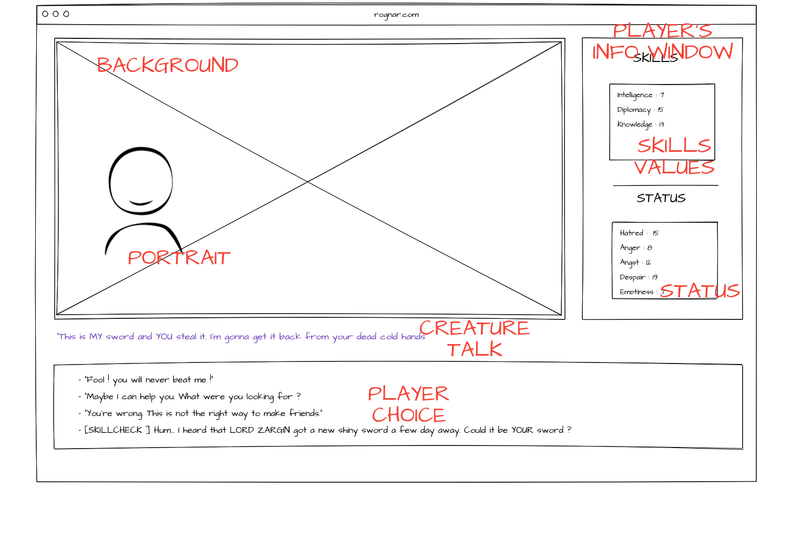

# Coding UX

Web langage are meant to be used for UX ! The two main programmation langage  for this are  are HTML and CSS ( note for coder : HTML and CSS are kind declarative langage aka you write down what you want your webpage to be, not what it does or how it should does anything).

Therefore, there are are very powerful for this kind of things. Lets see how to acheive the following UX :


## HTML

A web page with nothing in it look like tahat :

```html
<!doctype html>

<html lang="fr">

<head>
    <meta charset="utf-8">

    <title>Rognar</title>
    <meta name="description" content="A javascript  game">
    <meta name="author" content="arnold">


</head>

<body>


</body>

</html>
```
