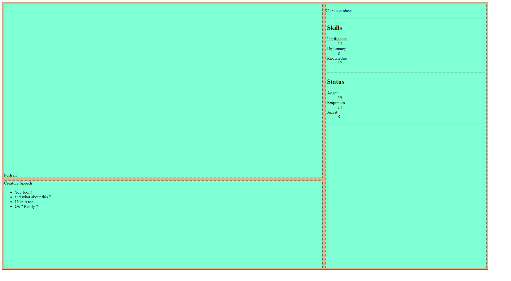

# Coding UX

Web langage are meant to be used for UX ! The two main programmation langage  for this are  are HTML and CSS ( note for coder : HTML and CSS are kind declarative langage aka you write down what you want your webpage to be, not what it does or how it should does anything).

Therefore, there are are very powerful for this kind of things. Lets see how to acheive the following UX :


## HTML

A web page with nothing in it look like that :

```html
<!doctype html>
<html lang="fr">
<head>
    <meta charset="utf-8">
    <title>Rognar</title>
    <meta name="description" content="A javascript  game">
    <meta name="author" content="arnold">
</head>

<body>
</body>

</html>
```

And it does nothing :


So first thing is, at least, listing all the element you need, nested the proper way. The important thing here is to put each element in the block their belongs to and in the order of display (more on this later). Putting class and id is done at this step :

```html
<html lang="fr">

<head>
    <meta charset="utf-8">

    <title>Rognar</title>
    <meta name="description" content="A javscript Roguelike game">
    <meta name="author" content="arnold">


</head>

<body>

    <main>
        <div id="screen">
            <section class="window">
                <div id="character-card"></div>
            </section>

            <footer class="window">
                <div id="creature-speech">Creature Speech</div>
                <nav id="player-choices">
                    <ul>
                        <li>You fool !</li>
                        <li>and what about this ?</li>
                        <li>I like it too</li>
                        <li>Oh ? Really ?</li>
                    </ul>
                </nav>
                </fotter>
        </div>
        <aside class="window">

            <p>Character sheet</p>
            <div id="skill-list" class="window">
                <h2>Skills</h2>
                <dl>
                    <dt>Intelligence</dt>
                    <dd>15</dd>
                    <dt>Diplomacy</dt>
                    <dd>8</dd>
                    <dt>Knowledge</dt>
                    <dd>12</dd>
                </dl>
            </div>
            <div id="status-list" class="window">
                <h2>Status</h2>
                <dl>
                    <dt>Anger</dt>
                    <dd>19</dd>
                    <dt>Emptiness</dt>
                    <dd>14</dd>
                    <dt>Angst</dt>
                    <dd>6</dd>
                </dl>
            </div>

        </aside>
    </main>

</body>


</html>
```

Note that I try to use semantic html as much as possible, event if it's a game ux and html element does not mean anything here. But anyway !


## CSS

Ok. We got our elements now let's style and position them. You need to link a css file, a stylesheet, in your html header in order to provide some styling :

```html
<head>
    <meta charset="utf-8">

    <title>Rognar</title>
    <meta name="description" content="A javascript Roguelike game">
    <meta name="author" content="arnold">

    <link rel="stylesheet" href="css/screen.css">

</head>
```


### Basic delimitations

First, in order to visualise my element better, lets style the window class (use whatever suits you, it's just to see each part) :

```css
.window {
    background-color: aquamarine;
    margin: 5px;
    border : 1px dashed #333;
}

main {
    background-color: burlywood;    
    border: 1px solid #333;
}
```


## Sizing

For this kind of app, I like the UX always be the same size and fill the whole screen, so that it looks fine when displayed full screen.
For this,  I use vh (view height) and vw (view width) to define size :

```css
main {
    background-color: burlywood;    
    border: 1px solid #333;
    height: 95vh;
    width: 95vw;
}
```

Thus the main window always fills 95% of the browser view :


Even if reduced :


## Positionning

Next part it the tricky part. Positionning element in CSS has alway been a pain in the ass but thx to recent evolution, you can now use something call flexbox ( note to coder : I DO prefer flexbox to grid system).

With flex box syntax, "all" you have to do is telling to your browser that some elements contain other elements whom position is flexible. All you do then is describing the ordering and the relative size of each element inside.
Here my flex containers are :

- the main window
- the so called screen
- the screen  that contains the section (portrait and background )   and the footer (speech box)
- the aside character sheet

Note that an element can be both flex container and flex item. For each flex item, I do provide the order and the relative width :

```css

main {
    background-color: burlywood;    
    border: 1px solid #333;
    height: 95vh;
    width: 95vw;
    display: flex;
    flex-direction: row ;
}


#screen {
    display: flex;
    flex-direction: column ;
    order :0;
    flex: 2
}

aside {
    order: 1;
    flex: 1;
    display: flex;
    flex-direction: column ;
}


section {
    flex: 2;
    display: flex;
    flex-direction: row ;
    align-items: flex-end;
}

footer {
    flex: 1;
}
```



*Is this fucking magic ?!*

Cool thing about flex is that you got reactive out of the box. If the screen size change, the windows size change :


## Adapting controls to screen

Even if flex provides size adaptation, I'd rather change the position of element for different screen. For example, when viewing the app on a screenphone, I want the windows stacked instead of sharing the screen width.
In css, this is call a **media query**. You can tell your browser to use a different CSS on different scree size. Here I just change the ordering of the element for screen less than 600px

```css
@media screen and (max-width: 600px){
    main {
        flex-direction: column;
    }
    
    aside {
        order: 0;
        flex: 1;
        flex-direction: row ;
    }
    
    #screen {
        order :1;
        flex: 8;
    }

    #skill-list {
        flex: 1;
    }

    #status-list {
        flex: 1;
    }
}
```

Now, when viewing on smaller screen, the character sheet is stacked on top of the main screen :


It is still a little big but anyway, we're gonna solve this later when dealing with UI graphics and styling. Yet, I do just care about positionning my element.


# Next

Ok. Seems good. Let's continue to [The Next part](part_4.md)

