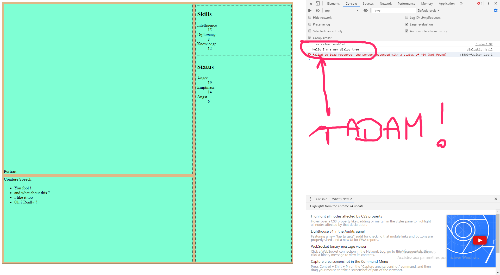
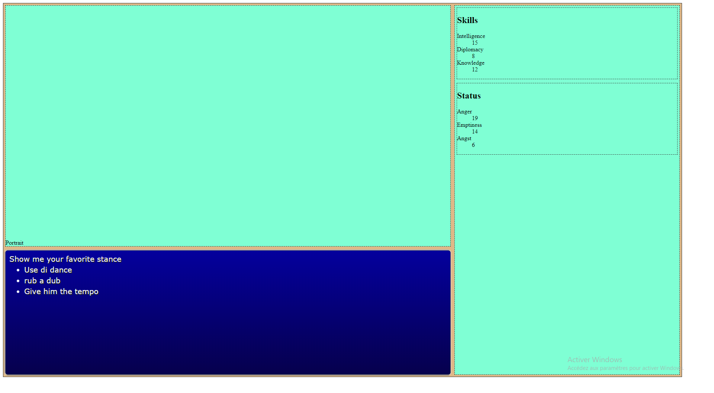
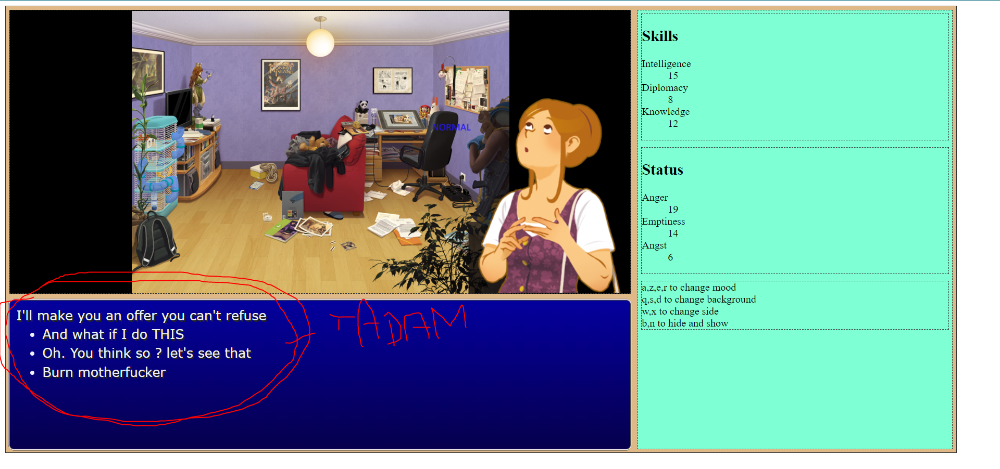
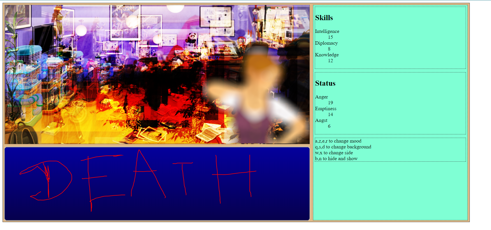

# Dialogue System

Dialogue system is heart of the game. 

As specified in the [design of the game](step-1_design.md), the dialogue engine should provide this features :

- For each step, there are many choice offered
- A choice leads to another steps
- steps affect status of the player
- some choices are offered only if some requirement are met

ok lets code.

## Step 0 : attaching a new dialog to html element

First thing is to design the dialog system from a coding perspective. I choose to use OOP (Oriented Object Programmation) and javascript Class syntax.
Like all my others features, Dialog system is implemented in [its own file](../modules/dialogLib.js).

Add a main.js file to the index.html (module) :

```html
<script src="main.js" type="module"></script>
```

Create a basic javascript Class with export : 

```javascript
/**
 *
 * @module dialogLib.js
 * A Lib for managing Speech
 */

"use strict";

export default class Writer {

    constructor() {
        console.log("Hello I m a new dialog tree");
    }

}
```

And then import it in main js and create a new dialog tree :

```javascript
"use strict";
import Writer from "./modules/dialogLib.js";
let Homer = new Writer();
```

Check in your console that something happens :



However, what we wanna do is the dialog Tree system to display something on the html element provided when creating the new Writer. Moreover, the Writer must have an update method that updates the text.

Lets do that with a static dialogue, that is :

- an header
- a list of choice


First, create the element you need :

```javascript
    constructor(dialogWindowId) {
        let target = document.getElementById(dialogWindowId);
        
        if(target) {
            this.target = target;

            this.target.classList.add("ff7");

            //Header with creature speech
            let creatureSpeechContainer = document.createElement("h2"); 
            creatureSpeechContainer.setAttribute("id","creature-speech");
            this.target.appendChild(creatureSpeechContainer);

            // The list of choice
            let playerChoiceContainer = document.createElement("ul"); 
            playerChoiceContainer.setAttribute("id","player-choice");
            this.target.appendChild(playerChoiceContainer);

        } else {
            console.error("The dialog Window Id you provided is not available");
        }
    }
```

And then add an update method that... well... update the dialog tree.
Remember that a dialogue step is ONE header and A LIST of choices. So its parameters should reflect this : 

```javascript
    update(speech, choices) {
        
        let hdr = this.target.querySelector("#creature-speech");
        let chc = this.target.querySelector("#player-choice");  
        let  newContent;

        //Empty them
        let cNode ;

        cNode = hdr.cloneNode(false);     
        hdr.parentNode.replaceChild(cNode ,hdr);
          
        cNode = chc.cloneNode(false);    
        chc.parentNode.replaceChild(cNode ,chc);


        hdr = this.target.querySelector("#creature-speech");
        newContent= document.createTextNode(speech); 
        hdr.appendChild(newContent);  

        chc = this.target.querySelector("#player-choice");  
        choices.forEach(function(el) {
            let l = document.createElement('li');        
            newContent= document.createTextNode(el); 

            l.appendChild(newContent);
            chc.appendChild(l);  
        });
        
    }
```

Test it in main.js :

```javascript

let Homer = new Writer("dialog-window");
Homer.update("Show me your favorite stance", ["Use di dance", "rub a dub", "Give him the tempo"]);
```

And it should display your text ( note : I add some CSS styling in a [separate CSS file](../css/speech.css).) :



Try it in a more fancy way !

```javascript

let Homer = new Writer("dialog-window");


let tree = [
    {
        speech : "Show me your favorite stance", 
        choices : ["Use di dance", "rub a dub", "Give him the tempo"]
    },
    {
        speech : "I'm on the rock", 
        choices : ["I check a stock", "I'm on the run"]
    },
    {
        speech : "When she walks", 
        choices : ["She's like a samba", "she swings so cool", "She sways so gentle","Each one she passes goes Ha","She looks straight ahead"]
    },
    {
        speech : "Se você disser que eu desafino", 
        choices : ["Saiba que isso em mim provoca imensa dor", "Se você insisted em classificar"]
    }
]

var i = 0;

function newText() {
    Homer.update(tree[i]["speech"], tree[i]["choices"]);
    if( i < tree.length) {
        i++;
        setTimeout(newText, 2000);
    }
}

newText();
```
Note than you can put a dialog in any windo you want :

```javascript
let Homer = new Writer("dialog-window");
let Joyce = new Writer("another-dialog");
```

## Navigatin the dialog tree

We got a structure to change and display a dialog but that is not very interesting. What we really want is a tree inside whom we can navigate and whom user choices cahge the output. 

For building that, I rather focus on the structure needed to do that (the model ) instead of the way to do it. If my model is good, implementation will follow.

Let's create a chapter_1.json file and fill it up.

*So what is a dialog tree ?*

it's a list of talks 

```javascript
{
    "talks":[]
}
```

*What is a talk ?*

It's a descriptive text and a list of reply

```javascript
{
    "talks":[
        {
            "text":"I'll make you an offer you can't refuse",
            "answer" : [
                "And what if I do THIS",
                "Oh. You think so ? let's see that",
                "Burn motherfucker"
            ]
        },
        {
            "text":"Why so serious ? Let's put a smile on that face",
            "answer": [
                "Eeerrrr... I'd rather try another way",
                "yeah. Sure. Let's do that"
            ]
        },
        {
            "text":"Just imagine if you ever woke up strapped to an unidentifiable contraption, to static on a TV that morphs into the Jigsaws face? What would run through your mind?",
            "answer":[
                "your heart stops",
                "it will be boring",
                "dunno",
                "your brain stops"
            ]
        }

    ]
}
```

*What happens when player makes a choice ?*

Because it's a game, we wanna that a reply lead to another talks. Thus, we need to index each talks AND we need that each reply lead to another index.

We could keep the array structure but it will be tedious for coder to keep trace of text index and orded when adding text to the dialog tree. I rather to use an associative array with keys that can be use as index.

```javascript
{
    "talks": {
        "001": {
            "text": "I'll make you an offer you can't refuse",
            "answer": [
                {
                    "reply": "And what if I do THIS",
                    "target": "010"
                },
                {
                    "reply": "Oh. You think so ? let's see that",
                    "target": "020"
                },
                {
                    "reply": "Burn motherfucker",
                    "target": "020"
                }
            ]
        },
        "010": {
            "text": "Why so serious ? Let's put a smile on that face",
            "answer": [
                {
                    "reply": "Eeerrrr... I'd rather try another way",
                    "target": "001"
                },
                {
                    "reply": "yeah. Sure. Let's do that",
                    "target": "020"
                }
            ]
        },
        "020": {
            "text": "Just imagine if you ever woke up strapped to an unidentifiable contraption, to static on a TV that morphs into the Jigsaws face? What would run through your mind?",
            "answer": [
                {
                    "reply": "your heart stops",
                    "target": "001"
                },
                {
                    "reply": "it will be boring",
                    "target": "010"
                },
                {
                    "reply": "dunno",
                    "target": "001"
                },
                {
                    "reply": "your brain stops",
                    "target": "010"
                }
            ]
        }
    }
}
```

Et voilà !

The first thing to do next is to write a loading method for our writer :

```javascript
    loadDialogTree(url) {
        // Load it the convenient way (read a file, a distant url, etc...)
        this.dialogTree = url;
        this.alreadyReadChoices=[];
        
    }
```

and of course, add a property to maintain the current choice :

```javascript

    this.dialogTree= {};
    this.currentTalk={};

```

Now we can implement it. Our dialog tree parser has to do something like that :

```
LOAD DIALOG TREE
SET  DIALOG TO FIRST TALK
WHILE DISCUSSION IS NOT FINISHED
  WAIT FOR PLAYER CHOICE
  ( apply player choice consequences)
  GO TO PLAYER CHOICE NEXT TALK
```

That could be implement this way :

**In DialogLib module : **

```javascript
    const _loadDialogTree = async function () {
        return await new Promise(function (res, rej) {
            res("my Dialogue Tree");
        });

    };

    [...]

    async runNewDialog(pathToDialogTree) {

        // Reset 
        this.alreadyReadChoices = [];
        this.dialogTree = await _loadDialogTree(pathToDialogTree);
        return 0;
    }


```

**In main.js**

```javascript
async function play() {
    await Homer.runNewDialog("pathToData");

    console.log("Homer dialog tree is");
    console.dir(Homer.dialogTree);
}

play();
```

Before diving further into implementation, let's stop a moment to talk about a difficult concept : asynchonicity.

#### Asynchronicity

Some operation and function resolve fast enough  to consider them synchronous, that is you get the result the same moment you ask for it ( not totally true dur to execution time but whatever ).

But some other operation are so long that you dont get your result when you ask it. For example you could ask to a human user the result of an addition and get the result few seconds later, because an human process operation slower. 
Or it could be that you load a big file over a slow network and you'll get your file minutes later.

In most of case this are call asynchronous operation and different programming language deal with it with different method, most of them being *callback* and *interrupt* a way for computer to continue its operation once the result is available but without stalling the whole process.

In javacript you can use the await and async keywords to tell "Ok, you gotta get your result later, once you got it, resume the programm here".

Hence the previous syntax.

### Loading

Ok now implement it by using a special javascript function call **fetch** that handle everything under the hood. Juste note that you have to :

- await for the file
- await for the "res.json", wich decode the response and put it a the data variable

```javascript
    const _loadDialogTree = async function (pathToData) {
        try {
            let res = await fetch(pathToData);
            let data =await  res.json();
            return data;

        } catch (error) {
            // Whatever the error, return  something null
            return null;
        }
    };


```

and modfy your runNewDialog method to update the UX :

```javascript
            // Load the dialogue tree
            this.dialogTree = await _loadDialogTree(pathToDialogTree);
            //Set the interface to the first talk

            if (this.dialogTree) {
                let t = this.dialogTree["talks"];

                // Get the first one
                let firstText = t[Object.keys(t)[0]];
                // Display it
                this.update(firstText.text, firstText.answer.map( el=>el.reply ));
            };
```

If everything is ok, you should get the first speech of your file displayed into your interface :



## Moving into the dialog Tree till the end

Now we want that when player make a choice, by clicking on it for example, the game moves into the dialog tree and if some issue is reached, the dialogue is resumed.

First, add a key in one of the text to tell that this is an issue (call it "issue" for example) :

```javascript
        "999":{
            "issue":"VICTORY"
        }
``` 

We're gonna use an asynchronous function that resolve when a certain element is fired. This function will be created when we a new dialogue is created.

```javascript
            // setup a new event for end of this dialogue         
            this.endOfDialogEvent = new CustomEvent("issue");

            // And then create a local promise that will resolve when event end of dialogue fired
            // Problem with that is that a listener is created each time a new dialog is ran 
            const dialogueIsDone = function () {
                let listeningElement = this.target;

                return new Promise(function (resolve) {
                    listeningElement.addEventListener("issue", el => resolve(el.result), false);
                });

            }.bind(this);

```

Of course, you have to await for it later in your runNewDialog function : 

```javascript
  async runNewDialog(pathToDialogTree) {

            [...]
   
            let res = await dialogueIsDone();

            // clean your mess
            var myNode = document.getElementById("player-choice");
            myNode.innerHTML = "";
            myNode = document.getElementById("creature-speech");
            myNode.innerHTML = "";

            return res;
        }
```

Now you can emit your custom event when dialogue reach an issue, emitting the issue result in the event :

```javascript

update(dialogue) {


    // If dialog is done, resume
    if (dialogue.hasOwnProperty("issue")) {
        this.endOfDialogEvent.result = dialogue["issue"];
        this.target.dispatchEvent(this.endOfDialogEvent);            
        return;
    }

[...]

```

In order to reach the target of a player choice, you can add event listener for click on a choice when building the choice list :

```javascript
  // Add an li for each options
            dialogue.answer.forEach(function (el) {
                // create as many list item as choice
                let l = document.createElement('li');
                l.classList.add("player-choice");
                // Create a text node with the reply text
                newContent = document.createTextNode(el.reply);

                // add a click listener on the answer 
                // where you bind the target
                // do not forget to pass the instance

                l.addEventListener("click", function (target, referenceToElement) {
                    let destination = this.dialogTree["talks"][target];

                    // Clean your mess
                    // especially the listener cause it can be
                    // perfmonging
                    
                    referenceToElement.parentNode.removeChild(referenceToElement);
                    if (destination) {
                        this.update(destination);
                    } else {
                        this.dbg.error("The expected target does not exists");
                    }


                }.bind(this, el.target));

```

The listener listen to a "click" on the li and when this happens, it call a function and pass the answer target ("el.target") to an anonymous function by using a bind. 

```javascript
l.addEventListener("click", function (target, referenceToElement) {
    let destination = this.dialogTree["talks"][target];
}.bind(this, el.target));
```

Thus, after having clean a little bit, you can call an update with this target.

```javascript
if (destination) {
    this.update(destination);
}
```
You can test that it works by awaiting for the result in your main : 

```javascript
        {
            "reply": "your brain stops",
            "target": "999"
        }
    ]
},
"999":{
    "issue":"VICTORY"
},
"998":{
    "issue":"DEATH"
}
```


```javascript
async function play() {
    let dialogueResult = await Homer.runNewDialog("../data/dialog_1.json");

    if(dialogueResult == "VICTORY") {
        Lba.mood="ANGRY";
        level_1.nigthScope();
    }

    if(dialogueResult == "DEATH") {
        Lba.mood="DIZZY";
        level_1.hallucination();
    }


}

play();
```
The code after the **await** should be executed once an issue has been reach in the dialog, result of this issue being return in the dailogResult variable.





##  Step 2 : add consequences to choice 

There are 2 kind of consequences : 

- when the player enters a new choice
- when the player choose a reply

The dialog tree schema must allow to describe that. Moreover, I think it would be better if this consequence can be defined as occuring only once or each time the player enters the choice. It means that we must keep a list of already made choices :

```javascript

export default class Writer {

    constructor(dialogWindowId) {
        let target = document.getElementById(dialogWindowId);
        
        // Properties 

        this.dialogTree= {};
        this.alreadyReadChoices=[];
        this.currentTalk={};


```

## Step 3 : add skillcheck

As in most of good RPG, Some replies are displayed only when some conditions are met. We must find a way to describe this condition in our dialog tree file and parse them with the writer Class.