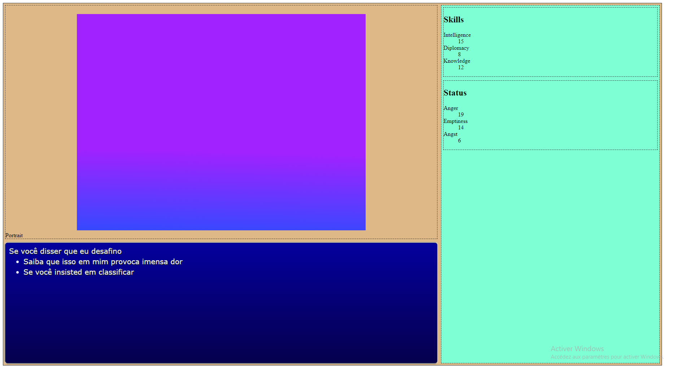
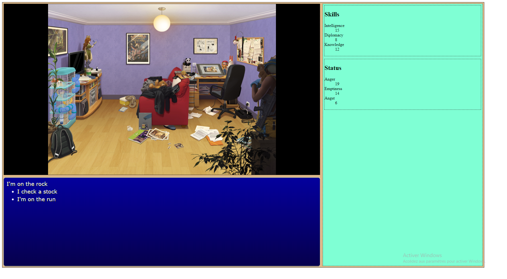
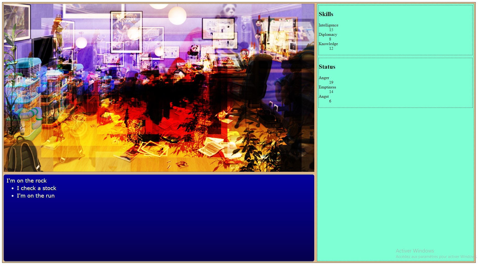

# Coding scene screen

One of interesting element of an RPG is graphical backgroud and NPC portrait taht react accordingly to their emotion or player speech.

Lets code it.

## Specifications

I want a new object (class) with at least this methods :

- change the background of the scene
- display NPC ( or player ) portrait
- change the emotion of the portrait
- change the side and orientation of the portrait ( in order to display it to the left or the right of the scene)
- maybe apply some effect in animation in order to show some transition

CSS provide convenient function to do that so most of the job is to bind some javascript method over this. Of course my new character class and background class must allo to put scene in any html element.

## Create a new background

First, create a new Scenery class that set some background properties :

```javascript

export default class Scenery {

    constructor(targetEl) {
        const defaultScenery=("./img/backgrounds/default.png");
         
        this.dbg = new Tracer("Background");
        this.dbg.unmute();
        this.dbg.info("Creating a new background");

        let parent = document.getElementById(targetEl);

        if (parent) {
            this.parent = parent;
            this.parent.classList.add("scenery");
            this.parent.style.backgroundPosition = " 0px 0px";


            this.parent.style.background = `no-repeat url("${defaultScenery}"), black`;
            this.parent.style.backgroundPosition = "center";
            this.parent.style.backgroundSize = "contain";

            this._scene=defaultScenery;   
        }
        else {
            this.dbg.error("No element exist for sprite placement");
            this.parent = null;

            this._scene="";   
        }

    }
}
```

and call it in main code :

```html
            <section id="scene" class="window">
                <div id="character-card">
                    <div>Portrait</div>
                </div>
            </section>
```

```javascript
let level_1 = new Scenery("scene");
```

Expect to have this displays ( *if you have made a default.png of course* ):



In order to change the background, you can use a *setter* like this :

```javascript
    set scene(url) {
        this.dbg.info("Set another background");        
        this.parent.style.background = `no-repeat url("${url}"), black`;
        this.parent.style.backgroundPosition = "center";        
        this.parent.style.backgroundSize = "contain";
        this._scene = url;
        
    }

    get scene() {
        return this._scene;
    }


```

Thus, you can change your background just by assigning an url to the *scene* property of your object :

```javascript
level_1.scene = "./img/backgrounds/room/lba-room.jpg";
```

(*The image has been provided by French artist Thorn, follow her on [her twitter](https://twitter.com/thorn_bulle?lang=fr) to see more of her works*)




( *note how the background property allow to have a centered fitted background whatever the size of the bck image* ) 


## Distorting background

For any scenery purpose, you can create method to your Scenery class in order to apply effect, for example :

```javascript
    hallucination() {
        this.parent.style.background=`no-repeat url("${this.scene}"),no-repeat url("${this.scene}"),no-repeat url("${this.scene}"),no-repeat url("${this.scene}"),no-repeat url("${this.scene}"),no-repeat url("${this.scene}")`;
        this.parent.style.backgroundSize = "200%, 80%, 60%, 50%, 40%, 100%";
        this.parent.style.backgroundPosition = "50%, 80%, 30%, 0";
        this.parent.style.backgroundBlendMode= "overlay";
        this.parent.style.backgroundRepeat = "no-repeat";
    }

```

( *this effects were done thanks to   [Bennett Feely explanations ](https://bennettfeely.com/image-effects/)*)

And then call it in order to apply a special effect : 

```javascript
level_1.hallucination()
```




Do not forget to write a remove effect function :

```javascript
    removeEffect() {
        this.dbg.info("remove all effects");        
        this.parent.style.background = `no-repeat url("${this.scene}"), black`;
        this.parent.style.backgroundPosition = "center";        
        this.parent.style.backgroundSize = "contain";        
        this.parent.style.backgroundBlendMode = "normal";
    }

```

```javascript
level_1.removeEffect()
```