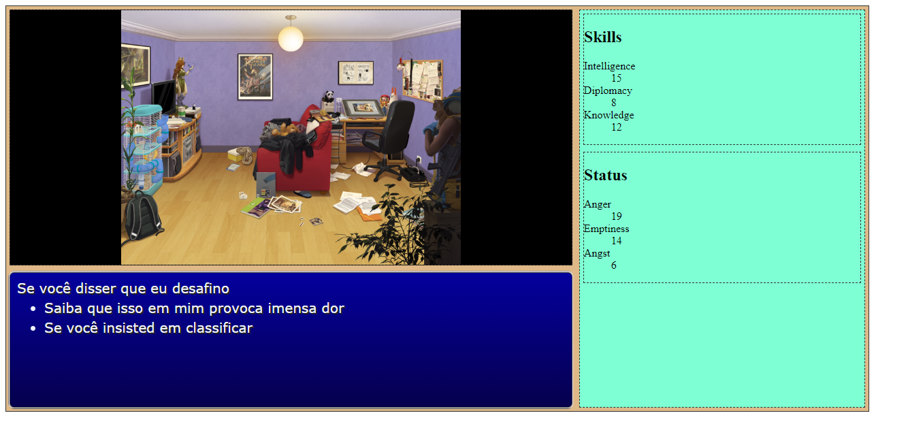

# Coding scene screen

One of interesting element of an RPG is graphical backgroud and NPC portrait taht react accordingly to their emotion or player speech.

Lets code it.

## Specifications

I want a new object (class) with at least this methods :

- change the background of the scene
- display NPC ( or player ) portrait
- change the emotion of the portrait
- change the side and orientation of the portrait ( in order to display it to the left or the right of the scene)
- maybe apply some effect in animation in order to show some transition

CSS provide convenient function to do that so most of the job is to bind some javascript method over this. Of course my new character class and background class must allo to put scene in any html element.

## Create a new background

First, create a new Scenery class that set some background properties :

```javascript

export default class Scenery {

    constructor(targetEl) {
        const defaultScenery=("./img/backgrounds/default.png");
         
        this.dbg = new Tracer("Background");
        this.dbg.unmute();
        this.dbg.info("Creating a new background");

        let parent = document.getElementById(targetEl);

        if (parent) {
            this.parent = parent;
            this.parent.classList.add("scenery");
            this.parent.style.backgroundPosition = " 0px 0px";


            this.parent.style.background = `no-repeat url("${defaultScenery}"), black`;
            this.parent.style.backgroundPosition = "center";
            this.parent.style.backgroundSize = "contain";

            this._scene=defaultScenery;   
        }
        else {
            this.dbg.error("No element exist for sprite placement");
            this.parent = null;

            this._scene="";   
        }

    }
}
```

and call it in main code :

```html
            <section id="scene" class="window">
                <div id="character-card">
                    <div>Portrait</div>
                </div>
            </section>
```

```javascript
let level_1 = new Scenery("scene");
```

Expect to have this displays ( *if you have made a default.png of course* ):


In order to change the background, you can use a *setter* like this :

```javascript
    set scene(url) {
        this.dbg.info("Set another background");        
        this.parent.style.background = `no-repeat url("${url}"), black`;
        this.parent.style.backgroundPosition = "center";        
        this.parent.style.backgroundSize = "contain";
        this._scene = url;
        
    }

    get scene() {
        return this._scene;
    }


```

Thus, you can change your background just by assigning an url to the *scene* property of your object :

```javascript
level_1.scene = "./img/backgrounds/room/lba-room.jpg";
```

(*The image has been provided by French artist Thorn, follow her on [her twitter](https://twitter.com/thorn_bulle?lang=fr) to see more of her works*)


( *note how the background property allow to have a centered fitted background whatever the size of the bck image* ) 




## Distorting background

For any scenery purpose, you can create method to your Scenery class in order to apply effect, for example :

```javascript
    hallucination() {
        this.parent.style.background=`no-repeat url("${this.scene}"),no-repeat url("${this.scene}"),no-repeat url("${this.scene}"),no-repeat url("${this.scene}"),no-repeat url("${this.scene}"),no-repeat url("${this.scene}")`;
        this.parent.style.backgroundSize = "200%, 80%, 60%, 50%, 40%, 100%";
        this.parent.style.backgroundPosition = "50%, 80%, 30%, 0";
        this.parent.style.backgroundBlendMode= "overlay";
        this.parent.style.backgroundRepeat = "no-repeat";
    }

```

( *this effects were done thanks to   [Bennett Feely explanations ](https://bennettfeely.com/image-effects/)*)

And then call it in order to apply a special effect : 

```javascript
level_1.hallucination()
```


Do not forget to write a remove effect function :

```javascript
    removeEffect() {
        this.dbg.info("remove all effects");        
        this.parent.style.background = `no-repeat url("${this.scene}"), black`;
        this.parent.style.backgroundPosition = "center";        
        this.parent.style.backgroundSize = "contain";        
        this.parent.style.backgroundBlendMode = "normal";
    }

```

```javascript
level_1.removeEffect()
```

## Adding character with emotions

Next thing I need is kinda character class that can express emotion. In order to keep production budjet low, we gonna use statics portraits that show different emotion.

A way to do that, and a good one because you reduce overhead for loading assets, is to use sprite sheet. A sprite sheet is an image, a png file for example, that contains all of the sprite needed on one image but with different coordinates.

It looks like this :


(it's only a mockup so the emotion name are not the one shown )
The most important thing to watch is that my image is 4 image of 335 px width. Thus, by adding n*335px, I get a different emotion.

if n=0, I got normal emotion, if n=1 I got sadness, if n=2 I got dizzyness, etc...

Let's code it 

### New character class

Add an html element to hold our character inside the scene :

```html
            <section id="scene" class="window">
                <div id="character-card"></div>
            </section>
```

And create a character class.


First, define some constant used for managing portrait :

```javascript

export const portraitWidth = 335;
export const portraitHeight = 310;

export const moodValues = {
    "NORMAL": 0,
    "SAD": 1,
    "DIZZY": 2,
    "ANGRY": 3
};

```

See how I map human readable values to integer. It does not serve any function for the game but it's way much readable for coder later. Remember : always map your enums ( that's the name of this technic ) to human readable variable (note : in some language like C there is enum keywords, not in javascript ).

Then create your class and constructor so that your spritesheet is attached to your target HTML element. 
Here I decide that my element fit the size of my portrait image but you could do it anotherway.

```javascript
export default class Character {

    constructor(targetEl, characClass = "diver") {
        this.dbg = new Tracer("Character");
        this.dbg.unmute();
        this.dbg.info("Loading New Character");
        this.character = characClass;


        let parent = document.getElementById(targetEl);

        if (parent) {
            this.parent = parent;
            this.parent.classList.add("portrait");
            this.parent.style.backgroundPosition = " 0px 0px";
            this.parent.style.width=`${portraitWidth}px`;
            this.parent.style.height=`${portraitHeight}px`;
            this.parent.style.marginLeft="auto";
            this.parent.style.marginRight="0px";
            this.parent.style.backgroundImage = `url("../img/sprites/characters/${characClass}.png")`;
        }
        else {
            this.dbg.error("No element exist for sprite placement");
            this.parent = null;
        }

        this.mood = "NORMAL";        
    }


}
```

Check that it fits the way you like in every screen size :

*normal*


*mobile*


*dumb*


And then call it in your main !

```javascript
let Lba = new Character("character-card","lba"); 
```

Here, I choose to use the character name as way to get the spritesheet, so the spritescheet must be named "<CHARACTER-NAME>.png" but we coulda built a more powerful system, with an associative array with several fields, etc...

But keep it simple if it works.

### Changing the mood

By using a sprite sheet, it's very easy to change the portrait when the mood is set just by changing the offset :

```javascript

    set mood(newMood) {
        let moodIdx = moodValues[newMood];

        if (!moodIdx) moodIdx=0;
        
        let offset = -1 * portraitWidth * moodIdx;
        this.parent.style.backgroundPosition = `${offset}px 0px`;
    }
```

Thus, changing the portrait is just a matter of assigning the mood in the main thread :

```javascript
document.onkeypress = function (e) {
    e = e || window.event;
   
    if (e.key==="a") Lba.mood="NORMAL";
    if (e.key==="z") Lba.mood="SAD";
    if (e.key==="e") Lba.mood="ANGRY";
    if (e.key==="r") Lba.mood="DIZZY";

    if (e.key==="q") level_1.nigthScope();
    if (e.key==="s") level_1.hallucination();
    if (e.key==="d") level_1.removeEffect();
};
```

You can change the side of the portrait too :

```javascript
    set focus(side)
    {
        if(side==="left") {
            this.parent.style.transform="scaleX(-1)";
            this.parent.style.marginRight="auto";
            this.parent.style.marginLeft="0px";
        } else {
            this.parent.style.transform="scaleX(1)";
            this.parent.style.marginLeft="auto";
            this.parent.style.marginRight="0px";
        }
    }
```

and test combination of changing mood and changing side : 

```javascript
    if (e.key==="w") Lba.focus="left";
    if (e.key==="x") Lba.focus="right";
```

*Different combination of mood and side*


And at last, add show and hide method, to manage many character :


```javascript
    hide() {
        this.parent.style.display="none";
    }

    show() {
        this.parent.style.display="block";        
    }
```