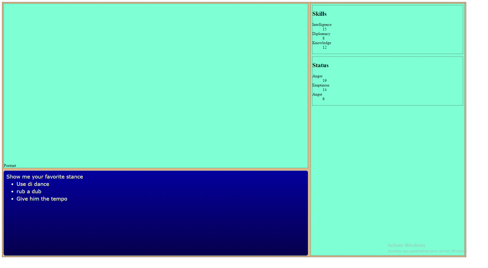

# Dialogue System

Dialogue system is heart of the game. 

As specified in the [design of the gam](step-1_design.md), the dialogue engine should provide this features :

- For each step, there are many choice offered
- A choice leads to another steps
- steps affect status of the player
- some choices are offered only if some requirement are met

ok lets code.

## Step 0 : attaching a new dialog to html element

First thing is to design the dialog system from a coding perspective. I choose to use OOP (Oriented Object Programmation) and javascript Class syntax.
Like all my others features, Dialog system is implemented in [its own file](../modules/dialogLib.js).

Add a main.js file to the index.html (module) :

```html
<script src="main.js" type="module"></script>
```

Create a basic javascript Class with export : 

```javascript
/**
 *
 * @module dialogLib.js
 * A Lib for managing Speech
 */

"use strict";

export default class Writer {

    constructor() {
        console.log("Hello I m a new dialog tree");
    }

}
```

And then import it in main js and create a new dialog tree :

```javascript
"use strict";
import Writer from "./modules/dialogLib.js";
let Homer = new Writer();
```

Check in your console that something happens :


However, what we wanna do is the dialog Tree system to display something on the html element provided when creating the new Writer. Moreover, the Writer must have an update method that updates the text.

Lets do that with a static dialogue, that is :

- an header
- a list of choice


First, create the element you need :

```javascript
    constructor(dialogWindowId) {
        let target = document.getElementById(dialogWindowId);
        
        if(target) {
            this.target = target;

            this.target.classList.add("ff7");

            //Header with creature speech
            let creatureSpeechContainer = document.createElement("h2"); 
            creatureSpeechContainer.setAttribute("id","creature-speech");
            this.target.appendChild(creatureSpeechContainer);

            // The list of choice
            let playerChoiceContainer = document.createElement("ul"); 
            playerChoiceContainer.setAttribute("id","player-choice");
            this.target.appendChild(playerChoiceContainer);

        } else {
            console.error("The dialog Window Id you provided is not available");
        }
    }
```

And then add an update method that... well... update the dialog tree.
Remember that an dialog step is ONE header and A LIST of choices. So its parameters should reflect this.

```javascript
    update(speech, choices) {
        
        let hdr = this.target.querySelector("#creature-speech");
        let chc = this.target.querySelector("#player-choice");  
        let  newContent;

        //Empty them
        let cNode ;

        cNode = hdr.cloneNode(false);     
        hdr.parentNode.replaceChild(cNode ,hdr);
          
        cNode = chc.cloneNode(false);    
        chc.parentNode.replaceChild(cNode ,chc);


        hdr = this.target.querySelector("#creature-speech");
        newContent= document.createTextNode(speech); 
        hdr.appendChild(newContent);  

        chc = this.target.querySelector("#player-choice");  
        choices.forEach(function(el) {
            let l = document.createElement('li');        
            newContent= document.createTextNode(el); 

            l.appendChild(newContent);
            chc.appendChild(l);  
        });
        
    }
```

Test it in main.js :

```javascript

let Homer = new Writer("dialog-window");
Homer.update("Show me your favorite stance", ["Use di dance", "rub a dub", "Give him the tempo"]);
```

And it should display your text ( note : I add some CSS styling in a [separate CSS file](../css/speech.css).) :



Try it in a more fancy way !

```javascript

let Homer = new Writer("dialog-window");


let tree = [
    {
        speech : "Show me your favorite stance", 
        choices : ["Use di dance", "rub a dub", "Give him the tempo"]
    },
    {
        speech : "I'm on the rock", 
        choices : ["I check a stock", "I'm on the run"]
    },
    {
        speech : "When she walks", 
        choices : ["She's like a samba", "she swings so cool", "She sways so gentle","Each one she passes goes Ha","She looks straight ahead"]
    },
    {
        speech : "Se você disser que eu desafino", 
        choices : ["Saiba que isso em mim provoca imensa dor", "Se você insisted em classificar"]
    }
]

var i = 0;

function newText() {
    Homer.update(tree[i]["speech"], tree[i]["choices"]);
    if( i < tree.length) {
        i++;
        setTimeout(newText, 2000);
    }
}

newText();
```

## Step 1 : Load real dialog tree and make it interactiv

## Step 2 : reflect the player choice to the characteer sheet and the portrait mood

## Step 3 : Add skill check 